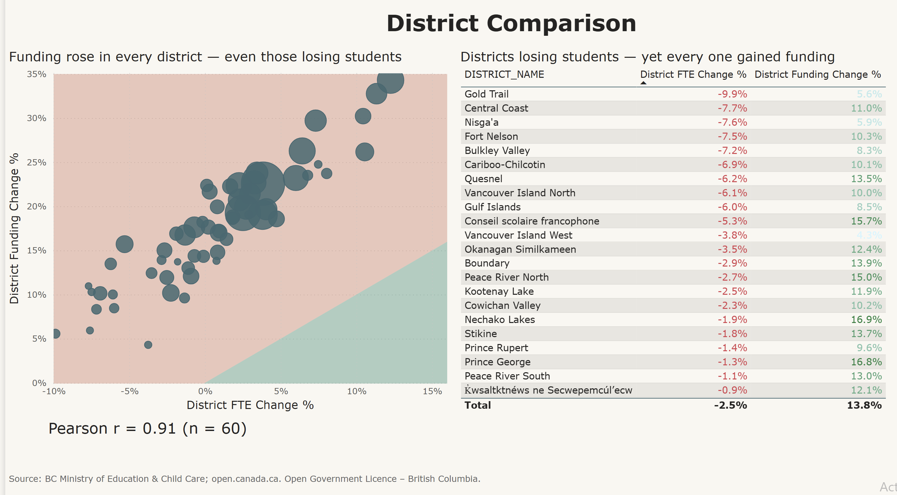
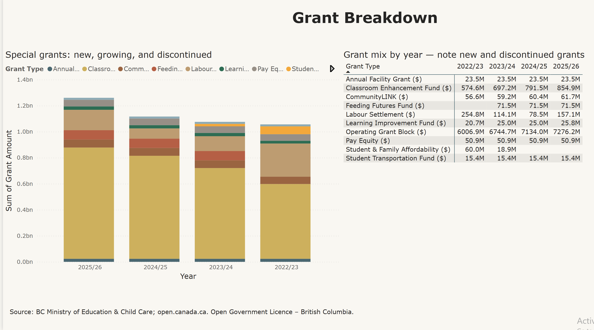

# BC K-12 Education — Funding vs Enrolment (SQL)

A self-directed analysis on **public BC open data**: pulling two separate government
datasets from source, cleaning them in Python, and using SQL to answer whether K-12
funding tracked student enrolment across British Columbia's 60 school districts
between 2022/23 and 2025/26.

> **Data:** BC Ministry of Education & Child Care, *"Summary of Grants to Date"* (funding),
> and *BC Schools: Student Enrolment and FTE* from [open.canada.ca](https://open.canada.ca)
> (enrolment). Licensed under the **Open Government Licence – British Columbia**.
> Real district names; no private or confidential data.

---

## What this project demonstrates

- **Getting data from source** — two independent public datasets at different grains,
  joined on district number.
- **Data cleaning in Python** — the raw enrolment file arrives as **137,581 rows**
  (per school, per grade). Filtering to district level, public schools, all grades and
  all facility types reduces it to **360 clean district-year rows** without double-counting.
- **SQL analysis** — CTEs, conditional aggregation, multi-source JOIN, and correlation.
- **Real debugging** — the JOIN initially returned zero rows. Three separate issues had
  to be found and fixed (see below).

---

## Key findings

| Metric | 2022/23 | 2025/26 | Change |
|--------|--------:|--------:|-------:|
| Total operating funding | $7.06B | $8.54B | **+20.9%** |
| Public district FTE | 582,365 | 600,743 | **+3.2%** |

- **Funding and enrolment correlate strongly across districts: Pearson r = 0.91** (n = 60).
- **Every district that lost students still gained funding** — 24 districts saw enrolment
  fall while their funding rose, because several grants (labour, facility, transportation)
  are not purely per-student.

---

## Debugging the JOIN — three issues found

The first JOIN returned 0 matching rows. Rather than guessing, I inspected the actual
key values in both tables:

1. **Year format mismatch** — funding used `2022/23`, enrolment used `2022/2023`.
2. **Key type mismatch** — district number was an integer in funding (`5`) but a float
   in enrolment (`5.0`), because pandas had promoted the column.
3. **Integer division** — SQLite divides integer columns as integers, so
   `f_end / f_start` silently returned `1` instead of `1.18`, making every funding
   change `0` and the correlation `NaN`. Fixed by forcing float division (`* 1.0`).

Each was found by querying the real values in both tables, not by assumption. This is
the same class of error that quietly corrupts a report if nobody reconciles the data.

---

## Repo structure

    ├── bc_education_sql.ipynb   # Python data prep + SQL analysis (SQLite)
    └── data/
        ├── funding_clean.csv     # 240 rows — district x year
        └── enrolment_clean.csv   # 360 rows — district x year (from 137,581 raw)

---

## Dashboard (Power BI)

An interactive Power BI dashboard built on the same public data, closing the
loop from raw source to visual insight.

**Page 1 — Overview:** funding vs enrolment trend and headline KPIs.
[Overview](01_overview.png)

**Page 2 — District Comparison:** per-district funding vs enrolment change
(scatter, r = 0.91) and the districts that lost students yet gained funding.

**Page 3 — Grant Breakdown:** how the grant mix shifted — new, growing, and
discontinued grants.

## Tools

**Python (pandas)** for data preparation · **SQL (SQLite)** for analysis — CTEs,
conditional aggregation, multi-table JOIN · public BC open data.
